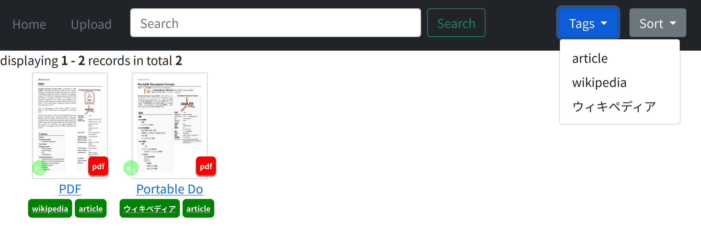
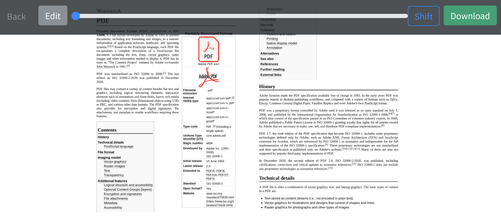
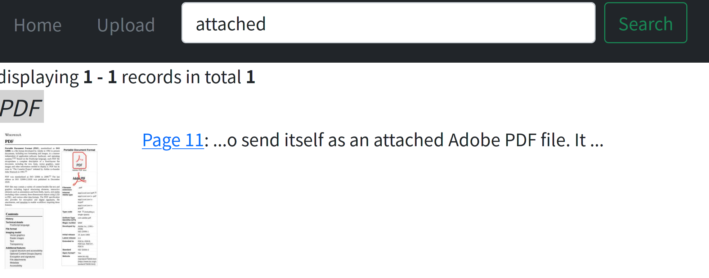
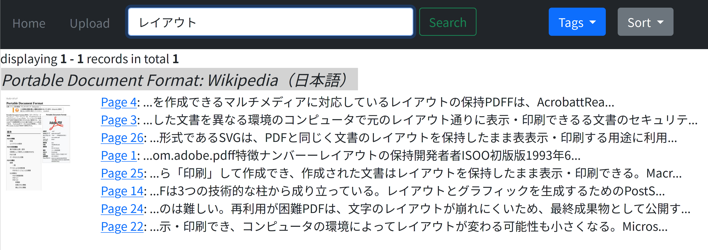
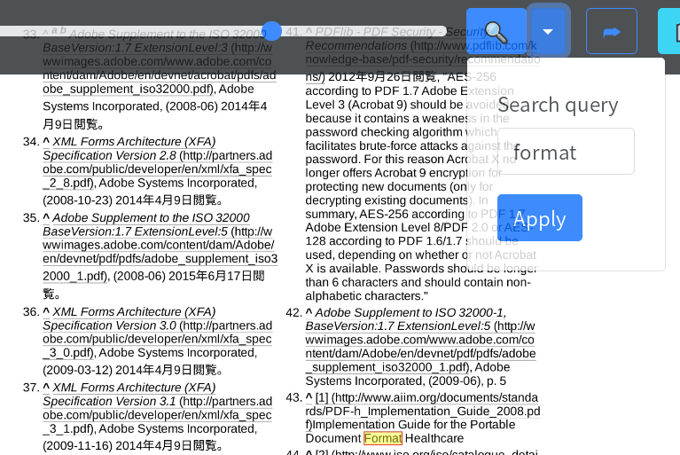
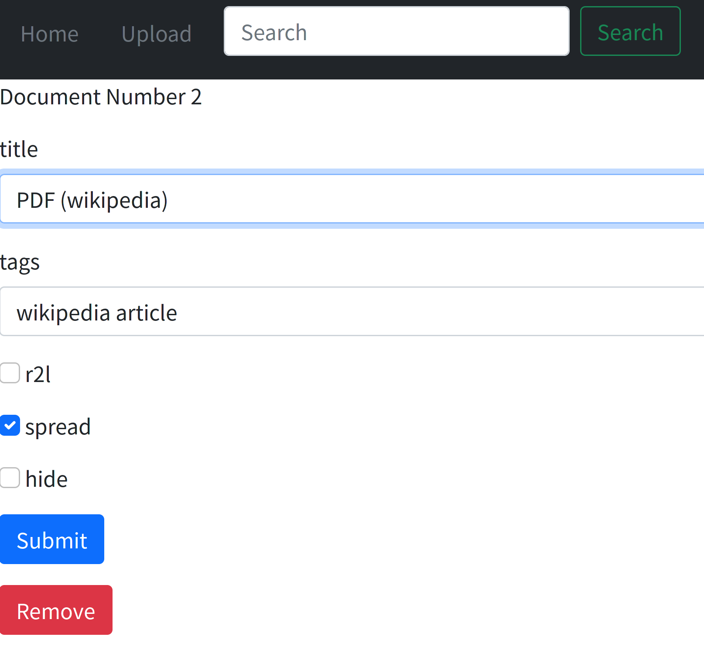

# fmfm: fast minimum file manager
A web-based document manager/viewer upon Flask+Python. Currently PDF, zip file (of images), markdown and epub documents are supported.

**This is still in beta stage and the code is not secure. Please do not use this on public servers.**

## For what?
* To collect all the books into a one place
* To read books using only web browsers
* To handle right-to-left format books (Japanese manga and vertical writing 縦書き) correctly
* To find sentences from all the stored documents at once (full text search)

## List view
Clicking thumbnail opens the viewer. The right bottom "PDF" badge jumps into the original file. Document tagging and searching are supported.

## Viewer
Tiny HTML-based document viewer is included. Capabilities:
* Single page / Spread view
* Show pages in Left-to-right or Right-to-left format (select by metadata edit)
* One page shifting (to correct facing page layout; shortcut: `S` key)
* Page forward and back by clicking left/right side, press left/right keys or mouse wheel scrolling

Epub reading is powered by [Bibi](https://github.com/satorumurmur/bibi). (This is a fantastic software!)

## Search
Full-text search (PDF, epub and markdown)

日本語も検索可能です Japanese search is supported. (tokenizer: 2-gram)

(PDF only) Search hits are highligted in page view; also in-page search is possible. (shortcut: `F` key)

## Edit metadata
* Edit menu is called from green button at bottom left on thumbnail.
* Multiple tags by separating them with a whitespace.
* `r2l`: the document is right-to-left (PDF and zip)
* `spread`: the document is shown in spread view (PDF and zip)
* `hide`: hides the document; it works, but **currently the file found by search**.

## Other features
* Multi-file uploading
* Ignores already registered file when uploading (by MD5 hash)
* Tiny tool for batch processing (`fmfm_util.py`) is included.
 - `fmfm_util.py import` ... to import all the files from `inbox` folder.
 - `fmfm_util.py remove 1 2 3` ... to remove specified books from DB.
 - `fmfm_util.py update 1 2 3` ... to update the metadata in the DB.
 - `fmfm_util.py update_title 1 2 3` ... to update the metadata, and title is replaced by the file's metadata.

## Install and run
1. `git clone` this repository and `cd` into the folder
1. Modify `SECRET_KEY` to something random string in `settings.py`
1. Download `Bibi-v1.2.0.zip` from [Bibi releases](https://github.com/satorumurmur/bibi/releases/tag/v1.2.0), unpack the file and move `Bibi-v1.2.0` folder into `static` folder.

* Docker
1. Do `docker-compose up -d`
1. Access to `http://localhost:8888` by a web browser.
1. You can stop the container by `docker container stop fmfm-filemanager-python3-1`.

* Linux (local)
1. `pip install -r requirements.txt` (You also need `cmake` and `poppler-cpp` package in a distro)
1. `python server.py` or `bash run_fmfm_local.sh`
1. Access to `http://localhost:5000/` (Former) or `http://localhost:8888/` (Latter) by a web browser.

## Tips
* Caching images and passthrough `static` files by nginx improves the performance. See `nginx_conf.sample` for example.

## Limitations and bugs
### Overall
* The code is ugly, repeating phrases and not well-formatted ;(
### Viewer
* PDF Viewer shows just an image, you cannot use browser's text search.
* PDF rendering is a bit heavy task, for SBCs like raspberry pi (RPi4 handles tasks well in my house though;)
* To suppress transfer size the result is compressed with JPEG, so the viewer shows lossy image.
* All the image is set to be cached. Please clear browser cache if you found odd behavior.
* Not all of markdown functionalities are supported.
### Search
* Full-text search with tag search is not possible yet.
* Search by date will be (IMHO) implemented but not yet.
### Upload
* Making index is a heavy task and sometimes a gateway timeout happens.
